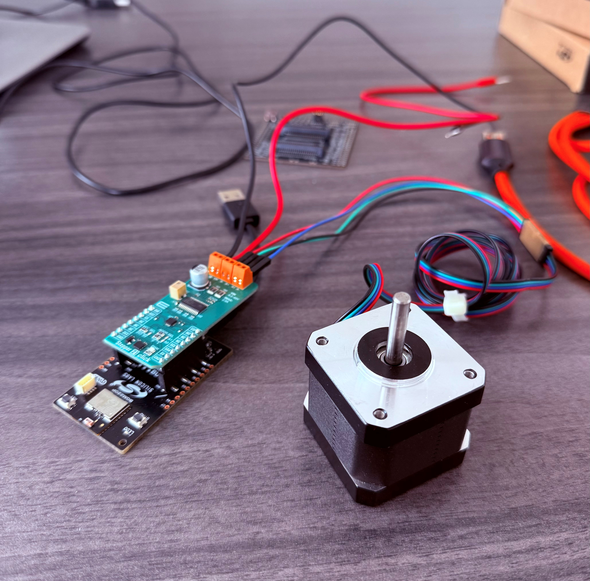

# SoC - DRV8825 stepper driver example

This example ports the MIKROE library for the Stepper 21 Click board (TI DRV8825).
It is developped for the BGM220 Explorer Kit (EK4314A), but can be easily adapted to other development kits.

In addition to the CLI, the user can interact with GATT attributes via BLE to control the motor.
Everything has been tested with the 17HE15-1504S stepper motor.

## Report Bugs & Get Support

You are always encouraged and welcome to report any issues you found to us via [Silicon Labs Community](https://www.silabs.com/community).
